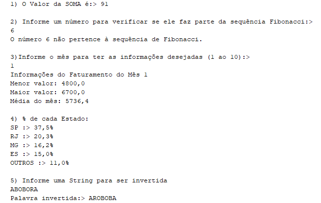

# CaseTecnicoTarget
## Linguagem utilizada: Java ☕

### Respostas / Observações sobre cada questão: 
#### 1) Valor encontrado: 91
#### 2) Utilizei de recursividade para resolver a questão, aproveitei para aplicar o conceito em cima do Fibonacci.
#### 3) - A Questão 3 pra mim foi a mais difícil, pois precesei trabalhar com JSON; - Criei um arquivo do tipo JSON com ajuda de IA, presente na pasta util/arquivo.json  - Utilizei algumas dependências que adicionei manualmente ao projeto conforme a necessidade - Foi necessário criar uma classe que comportasse a estrutura do arquivo JSON, mapear e configurar o mapper para trabalhar com estruturas do tipo date (encontrei um erro ao trocar a estrutura antes mapeada em String para LocalDate) 
#### 4) Resposta: SP :> 37,5% RJ :> 20,3% MG :> 16,2% ES :> 15,0% OUTROS :> 11,0%
#### 5) - Inverti a String percorrendo as posições e concatenando de maneira manual utilizando de Character.toString(palavra.charAt(i)) e devolvendo o valor resultando a String original - Em C essa inversão de String ficaria mais interessante por mecher com vetor

### Imagem do OutPut

🌵